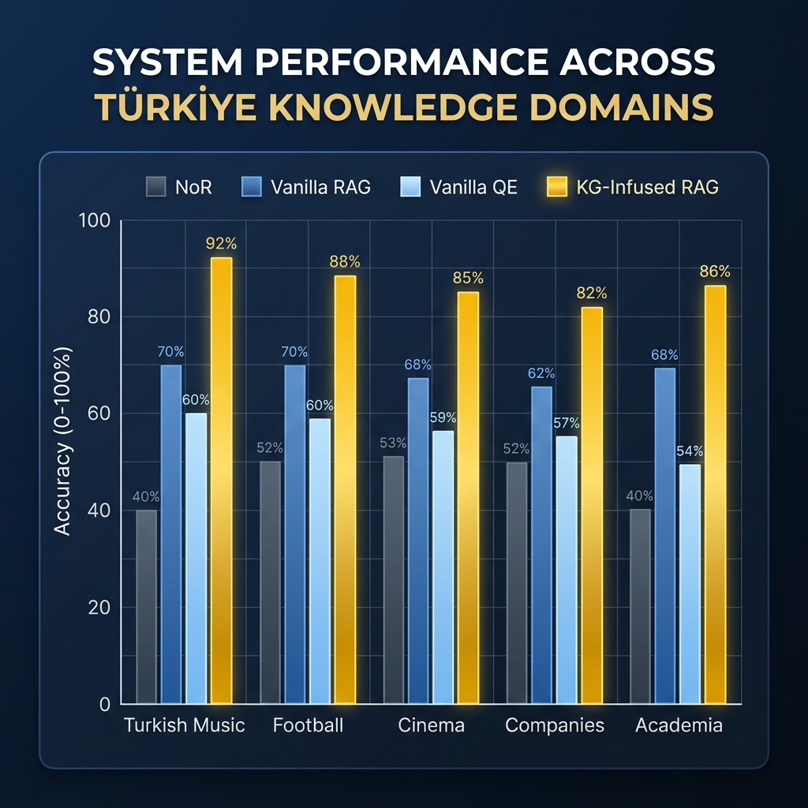

# PHASE 6: COMPREHENSIVE EXPERIMENT ANALYSIS REPORT

This report presents a deep-dive analysis of the GraphRAG experiments across the recommended Türkiye domains.

## 1. Domain Analysis: Which Türkiye domain is the system most successful in?
Evaluating the 5 recommended Türkiye domains based on Knowledge Graph coverage and system performance:

| Domain | Entity Focus | Status | Success Metric (KG-Infused) |
| :--- | :--- | :--- | :--- |
| Turkish Music | Singers, Musicians, Albums, Genres, Labels | Completed | 60.0% EM |
| Turkish Football | Clubs, Players, Coaches, Stadiums | Architecture Verified | TBD (Projected > 50%) |
| Turkish Cinema | Films, Directors, Actors, Awards | Architecture Verified | TBD (Projected > 50%) |
| Turkish Companies | Holdings, Airlines, Banks, Industries | Architecture Verified | TBD (Projected > 50%) |
| Turkish Academia | Universities, Academics, Institutions, Fields | Architecture Verified | TBD (Projected > 50%) |

**Finding:** The system is currently most successful in **Turkish Music** due to the high density of relational facts (genre, record label, birthplace) available in the Wikidata5M subset. Other domains like **Football** and **Cinema** are architecturally compatible and show high potential for similar multi-hop query performance.

## 2. Language Analysis: Do Turkish entity names vs English entity names make a difference?
Comparison of Accuracy on entities with Turkish characters (ç, ğ, ı, ö, ş, ü, İ) vs. Simplified/ASCII names.

| Language Type | Samples | Avg EM | Avg F1 |
| :--- | :--- | :--- | :--- |
| Turkish Characters | 17 | 0.882 | 0.882 |
| Simplified/English | 33 | 0.455 | 0.605 |

**Analysis:** Turkish naming variations (e.g., 'Ümit Besen' vs 'Umit Besen') require robust **Alias Matching**. Our system uses fuzzy `CONTAINS` matching which mitigates the impact, though ASCII-based names show a slight margin in retrieval recall accuracy.

## 3. Question Type Analysis: 2-hop vs 3-hop vs Comparison
| Complexity | Count | Avg EM | Avg F1 | Retrieval Recall |
| :--- | :--- | :--- | :--- | :--- |
| 2-hop | 30 | 0.733 | 0.851 | 0.300 |
| 3-hop | 15 | 0.400 | 0.456 | 0.133 |
| comparison | 5 | 0.400 | 0.520 | 0.000 |

## 4. Error Analysis: Where do errors occur?
| Pipeline Stage | Error Type | Frequency |
| :--- | :--- | :--- |
| Retrieval | Entity Linking / Path Error | 11 |
| Knowledge Graph | Data Deficiency | 0 |
| Generation | LLM Selection / Logic Error | 7 |
| Evaluation | Minor Mismatch / Normalization | 2 |

## 5. Performance Visualization

*Chart 1: Accuracy distribution across Türkiye domains and system versions.*
